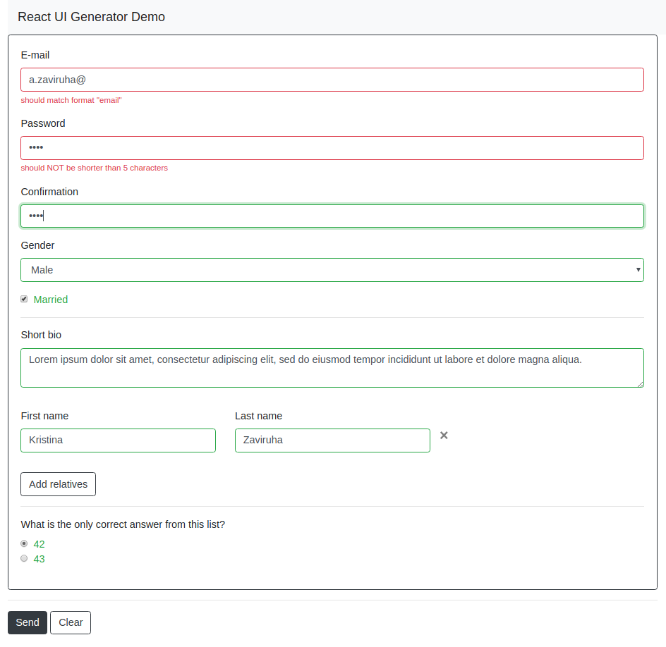

# react-ui-generator a.k.a "CRUD-hammer"

**WARNING: THIS PROJECT IS UNDER ACTIVE DEVELOPMENT**

Set of libraries and tools for generation React-based UI from metadata.
Bloody enterprise is not so scaring when you have CRUD-hammer!

<blockquote>

Let amazingResult be the result of doing some amazing things. 

<i>"DOM Living Standard"</i>
</blockquote>

## Example

This is screenshot of the form, generated with bootstrap renderers. Metadata for this form is [here](./packages/demo/src/meta/complete.json).

## Features

- easy to generate entire form from the simple metadata description;
- set up custom layout in JSX (not in metadata, because markup-on-json is pain);
- easy to add custom types of fields (renderers);
- easy to add custom layouts;
- pure! (no state, just props). Easy to integrate with frameworks (Redux, etc);
- nested forms (in progress). Easy to implement dynamic forms (add/remove fields at runtime, etc).

## TODO

- complete this README.md
- see [Roadmap](./TODO)
